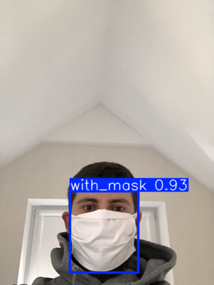
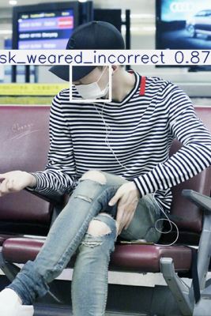

# Face Mask Detection — YOLOv8 (Production-Ready Pipeline)

## Overview

This repository implements an **end-to-end object detection system** for monitoring **face mask compliance** in public environments such as **airports, railway stations, malls, and offices**.

The system detects and classifies faces into three categories:

- `with_mask`
- `without_mask`
- `mask_weared_incorrect`

The project is designed as a **production-grade ML pipeline**, covering **data preprocessing, training, evaluation, inference, deployment, containerization, and CI validation**.

---

## Key Features

- YOLOv8-based object detection (**CPU-compatible**)
- Pascal VOC → YOLO annotation conversion
- Reproducible train / validation / test split
- Quantitative evaluation (mAP, precision, recall)
- Batch inference with visualization
- Streamlit-based interactive demo
- Dockerized deployment
- CI/CD with **dataset-free inference smoke tests**

---

## Dataset

- **Source:** Kaggle – Face Mask Detection dataset  
- **Annotations:** Pascal VOC (XML)  
- **Preprocessing:** Converted to YOLO format  

> **Note:**  
> Raw and processed datasets are intentionally **excluded** from the repository to keep it lightweight, reproducible, and license-safe.

---

## Project Structure

```
face-mask-detector-yolov8/
│
├── artifacts/
│   ├── yolov8_face_mask/
│   │   ├── weights/
│   │   │   └── best.pt                # Final trained model
│   │   ├── results.png                # Training metrics summary
│   │   ├── confusion_matrix.png
│   │   ├── confusion_matrix_normalized.png
│   │   └── results.csv
│   │
│   └── inference_outputs/             # Sample inference visualizations
│
├── configs/
│   └── dataset.yaml                   # YOLO dataset configuration
│
├── src/
│   ├── data/
│   │   ├── voc_to_yolo.py              # VOC → YOLO conversion
│   │   └── split_dataset.py            # Train/Val/Test split
│   │
│   ├── inference/
│   │   └── run_inference.py            # Batch inference + visualization
│   │
│   └── app/
│       └── app.py                     # Streamlit application
│
├── .github/
│   └── workflows/
│       └── ci.yml                     # CI pipeline
│
├── Dockerfile
├── requirements.txt
├── requirements-dev.txt
├── .gitignore
└── README.md
```
## Pipeline Overview

### 1. Annotation Conversion
- Pascal VOC (XML) annotations are converted into YOLO format.
- Ensures compatibility with the YOLOv8 training pipeline.

### 2. Dataset Splitting
- Deterministic train / validation / test split.
- Guarantees reproducibility across runs and environments.

### 3. Model Training
- YOLOv8 model fine-tuned on the face mask detection dataset.
- Configured to be **CPU-friendly**, enabling training and inference without GPU dependency.

### 4. Evaluation
The model is evaluated using standard object detection metrics:

- **Precision**
- **Recall**
- **mAP@0.5**
- **mAP@0.5–0.95**

Additional artifacts generated:
- Confusion matrix
- Normalized confusion matrix
- Training curves and metrics summary

### 5. Inference
- Batch inference with bounding box visualization.
- Supports inference on image files as well as tensor inputs.
- Outputs rendered with class labels and confidence scores.

### 6. Deployment
- Interactive **Streamlit web application** for real-time inference.
- Fully Dockerized to ensure reproducible execution across systems.

### 7. CI Validation
- GitHub Actions pipeline performs:
  - Dependency installation
  - Model loading verification
  - Dataset-free inference smoke test using synthetic tensors

---

## Results

| Metric        | Value |
|---------------|-------|
| mAP@0.5       | 0.82  |
| Precision     | 0.89  |
| Recall        | 0.75  |
| mAP@0.5–0.95  | 0.55  |

---

## Inference Demo

Sample inference results generated using the trained model include:

- Bounding boxes with class labels
- Confidence scores rendered on images

See: `artifacts/inference_outputs/`
Note: A public demo is intentionally omitted due to compute requirements. The project focuses on production-ready training, inference, CI, and containerization.

### Demo Features
- Upload an image via browser
- YOLOv8-based face mask detection
- Bounding boxes with class labels and confidence scores
- CPU-compatible inference

### Demo Screenshots

<p align="center">
  
  
</p>

### Run Locally (Streamlit)

```bash
streamlit run src/app/app.py
```
---

## Deployment

### Run with Docker

```bash
docker build -t face-mask-detector .
docker run -p 8501:8501 face-mask-detector
access the application at 
http://localhost:8501
```
## CI/CD

The continuous integration pipeline validates the following:

- Environment setup and dependency installation
- Model loadability and deserialization
- Forward-pass inference using dummy tensors (no dataset dependency)

This design ensures **fast, deterministic, and reproducible validation** across different environments.

---

## Notes on Reproducibility

- Datasets are externalized and excluded from version control.
- Only the final trained model and key evaluation artifacts are versioned.
- Intermediate training outputs and raw data are intentionally ignored to maintain repository cleanliness.

---

## Tech Stack

- Python 3.10  
- PyTorch  
- YOLOv8 (Ultralytics)  
- OpenCV  
- Streamlit  
- Docker  
- GitHub Actions  

---

## Author

**Naqshab Javed**
